<!--
    TITLE:      README
    AUTOR:      GUSTAVO GONÇALVES DIAS NEVES
    DATA_INIT:  26.01.2023

    PROJECT:    APP 5S - POWER APPS (LOWER-CODE)
    
    CONNECT ME:
        Linkedin: https://www.linkedin.com/in/gustavo-gon%C3%A7alves-dias-neves-3b76b3252/
        github (curr-account): https://github.com/gustavogoncalvesdiasneves/
        
 -->

<h1 align="center" alt="Aplicativo de Gestão 5S"><strong>Aplicativo 5S</strong></h1>

 

Esse projeto tem o objetivo de ajudar as empresas com a Gestão do 5S, por base do Microsoft Power Apps (Microsoft 365 - Plataforma de Apps Intranet).

 

**OBS: Borrei a Logo por integridade a Empresa.** 

 

<h2>Índice</h2>

- **[Descrição](#descrição)** 
- **[Características](#características)** 
- **[Futuras Novidades](#futuras-novidades)** 

  

## **Descrição**
[APP 5S][link-app-5s] é um Aplicativo de Gestão 5S, mais voltado a gestão de preenchimento de check-lists dos setores da empresa, podendo ter a visualização por Graficos Power BI (Graficos Inteligentes), e premiações utilizando notificações quando se é premiado (OBS: essas premiações passava para um grafico de controle geral que a empresa tinha acesso para premiar o funcionario), O App possui tela Admin para não precisar do Gestor do App para funções mais especificas, como: Cadastrar Funcionarios Novos, Remover ou Editar(Podendo editar o previlegio de um usuario que não tem acesso a tela Admin para ter acesso), Adicionar Mais Opções na Check-List de um Setor, ou Remover ou Editar, Visualizador dos PDFs gerados quando enviados os checklists (também havendo possibilidade de remover), Tela de Premiações, IMG para JSON (Tela do Gestor - Um Conversor de IMG para formato JSON, utilizados na automação de criação de PDFs), entre outras muitas funções =D.

  

## **Características**
A aplicação fornece os seguintes recursos:
- [CheckList](#checklist) (Baseada no Share-Point como Banco de Dados)
- [FocalPoints](#focalpoints) (Tela onde o usuario pode verificar oque cada FocalPoint faz em sua aréa)
- [Indicadores](#indicadores) (Graficos Inteligentes e Comparativos)  
- Meus CheckLists (Podendo Visualizar Todos os Checklist's que o usuario enviou até o momento utilizando o app)
- Tela Admin (Contendo Funções Previlegiadas, Somente Admins e Gestor tem Acesso á essa tela)

## **Futuras Novidades**
- APLICATIVO DESCONTINUADO

  

## **CheckList**

CheckList foi baseado em uma Lista de Share-point-sever, tendo todos seu dados armazendos na nuvem.

<table border="0" cellpadding="1" cellspacing="1" style="width:500px">
	<tbody>
		<tr>
			<td>
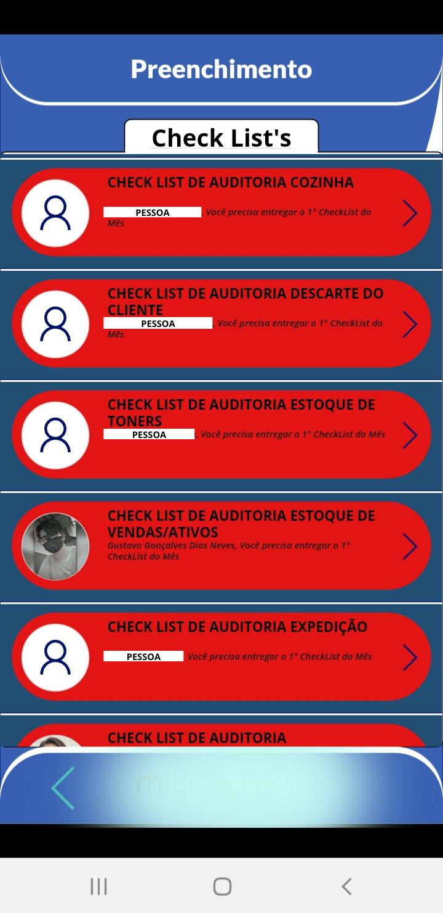</td>
			<td>
			<table border="0" cellpadding="1" cellspacing="1" style="width:500px">
				<tbody>
					<tr>
						<td><strong>
   VERMELHO - Quando o usuario <ins>NÂO</ins> enviou nenhum CheckList
</strong></td></td>
					</tr>
					<tr>
						<td><strong>
   AMARELO - Quando o usuario enviou <ins>APENAS UM</ins> CheckList
</strong></td>
					</tr>
					<tr>
						<td><strong>
  VERDE - Quando o usuario enviou <ins>TODOS</ins> os CheckLists (2 Checklists)
<strong></td>
					</tr>
				</tbody>
			</table>
			</td>
		</tr>
	</tbody>
</table>

 

## **FocalPoints**

Tela onde os usuarios podem ver oque cada setor segundo a orientação do 5S da empresa necesita que ele realize.

<table border="0" cellpadding="1" cellspacing="1" style="width:500px">
	<tbody>
		<tr>
			<td><strong>
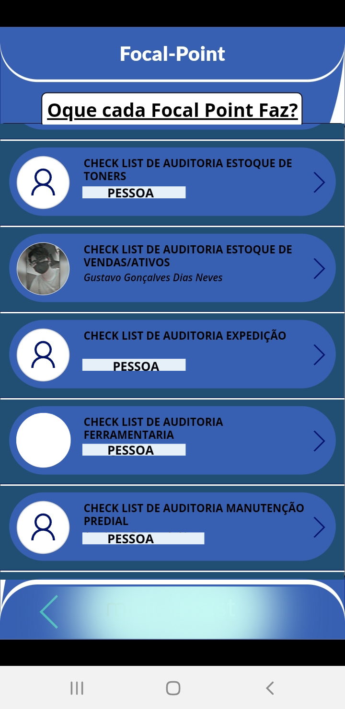  Lista de <ins>TODOS</ins> os FocalPoints
<strong></td>
			<td><strong>
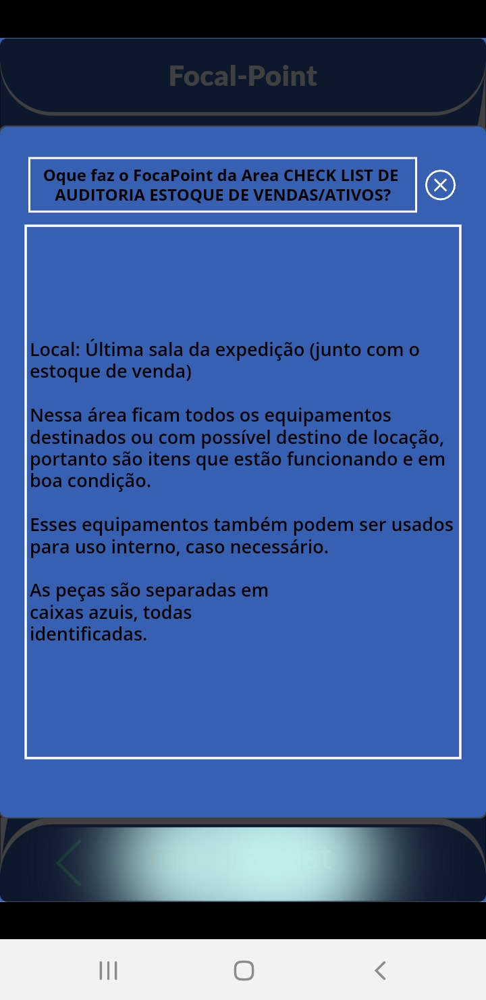  Orientação do <ins>Atual FocalPoint</ins> da Pessoa.
<strong></td>
		</tr>
	</tbody>
</table>
		
 

## **Indicadores**
		
**Grafico Geral**

Tela onde o usuario pode e Administradores podem ver um **Grafico Geral** e um Grafico com **Valores Unicos** de cada setor.
		
<table border="0" cellpadding="1" cellspacing="1" style="width:500px">
	<tbody>
		<tr>
			<td><strong>
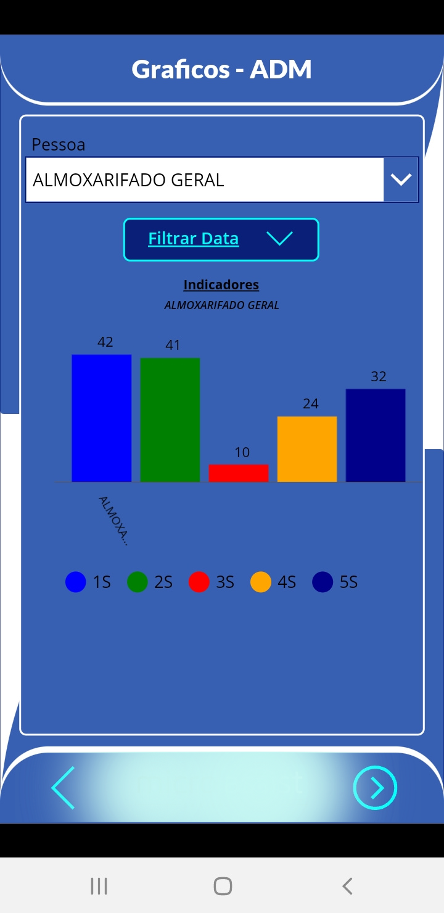  Grafico Geral
<strong></td>
			<td><strong>
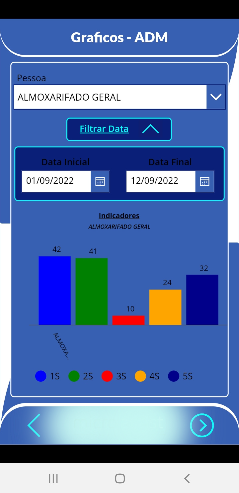  Possibilidade de <ins>Filtrar por Datas</ins>
<strong></td>
			<td><strong>
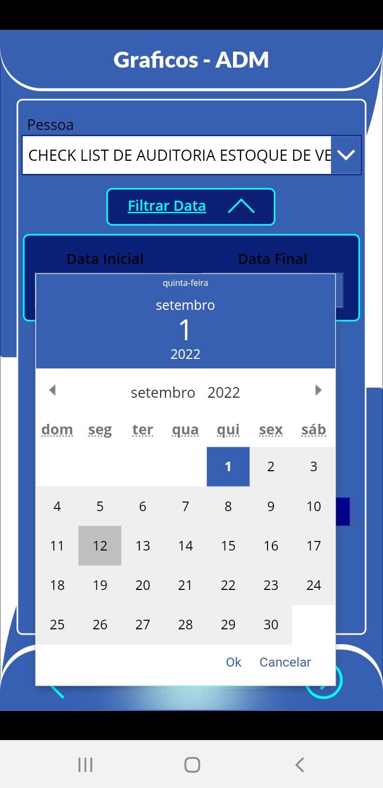  Basta selecionar a <ins>Data</ins> que deseje que o Grafico Filtre.
<strong></td>
			<td><strong>
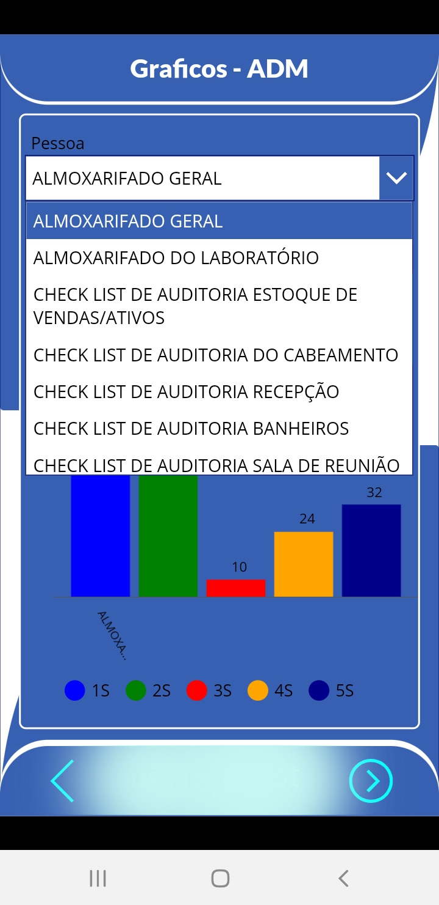  Possibilidade de  <ins>visualizar outros setores</ins>
<strong></td>
			<td><strong>
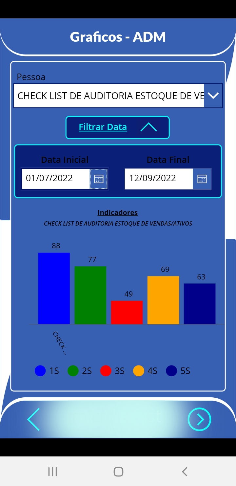  Depois de selecionar o <ins>Setor</ins> e <ins>Datas</ins> desejadas o grafico automaticamente filtrará :D 
<strong></td>
		</tr>
	</tbody>
</table>
				
**Grafico Unico**
				

				
<h3 align="center">IMPORTANTE</h3>
				
<strong>
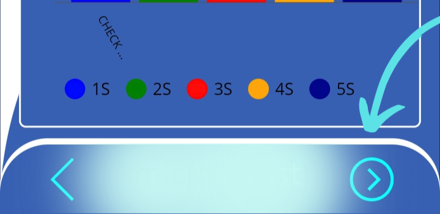  Para passar do <ins>Grafico Geral</ins> para o <ins>Grafico Unico</ins> Clique no Botão da Seta para Direita.
<strong>
	

Grafico onde pode ver as diferenças de cada setor por **S** Separados. (Com Bonus de Soma Geral de Todos os S)
				
<table border="0" cellpadding="1" cellspacing="1" style="width:500px">
	<tbody>
		<tr>
			<td><strong>
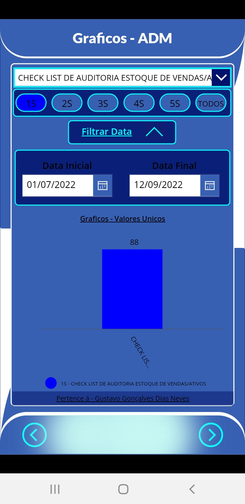  Grafico Mostrando somente o <ins>1S</ins>
<strong></td>
			<td>
			<table border="0" cellpadding="1" cellspacing="1" style="width:500px">
				<tbody>
					<tr>
						<td><strong>
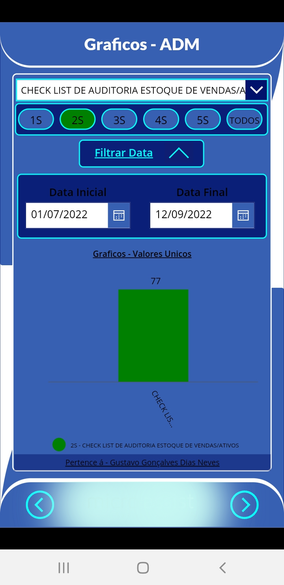  Grafico Mostrando somente o <ins>2S</ins>
<strong></td>
						<td><strong>
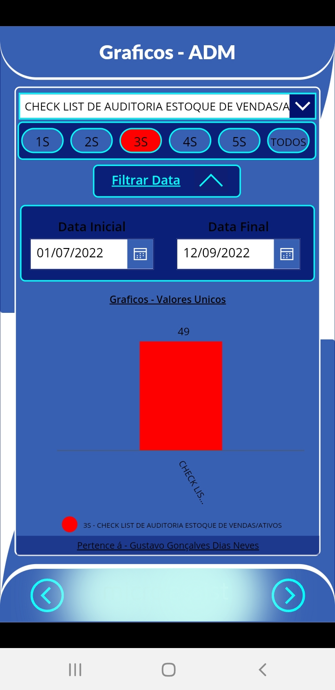  Grafico Mostrando somente o <ins>3S</ins> 
<strong></td>
					</tr>
					<tr>
						<td><strong>
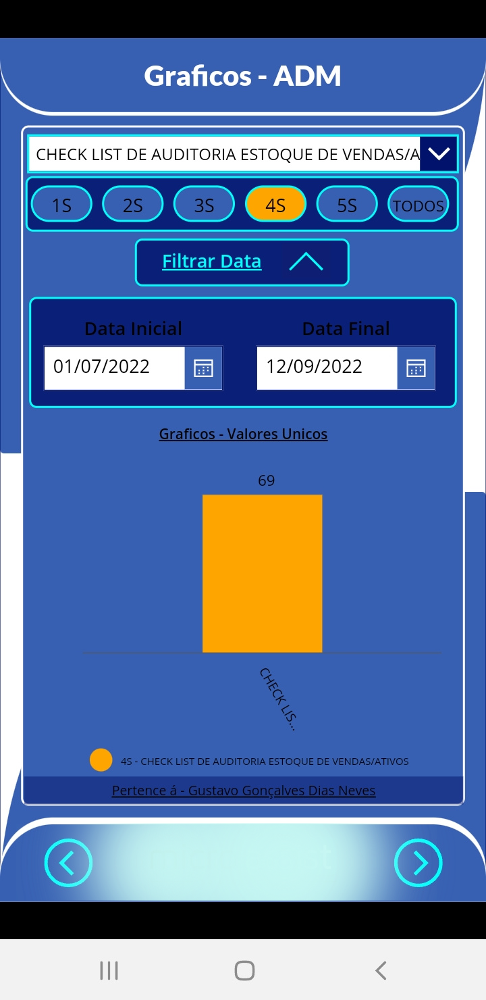  Grafico Mostrando somente o  <ins>4S</ins>
<strong></td>
						<td><strong>
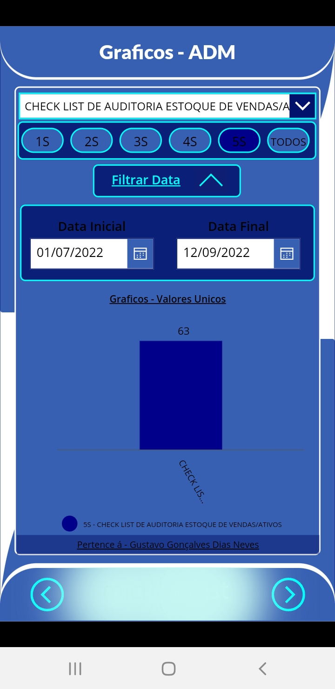  Grafico Mostrando somente o <ins>5S</ins>
<strong></td>
					</tr>
				</tbody>
			</table>
			</td>
			<td><strong>
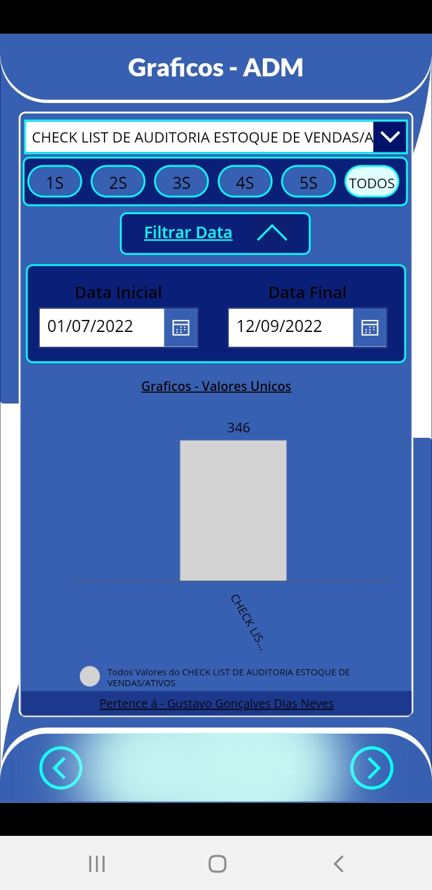  Grafico Mostrando a soma de  <ins>Todos os 5S</ins>
<strong></td>
		</tr>
	</tbody>
</table>

<!-- 
    LOCAL VARIABLES
 -->

[link-app-5s]: https://github.com/gustavogoncalvesdiasneves/Aplicativo_5S_-PowerApps-/
[link-executavel]: https://github.com/gustavogoncalvesdiasneves/BOT_LinkedIn/tree/main/build/Executavel
[link-video]: https://www.youtube.com/channel/UC_9SeJaG7zalUCosUt8BnFA
[link-pdf-navegador]: http://www.gestaoescolar.diaadia.pr.gov.br/arquivos/File/pde_roteiros/como_identificar_versao_navegador_pronto.pdf
[chrome-driver-link]: https://chromedriver.chromium.org/downloads
